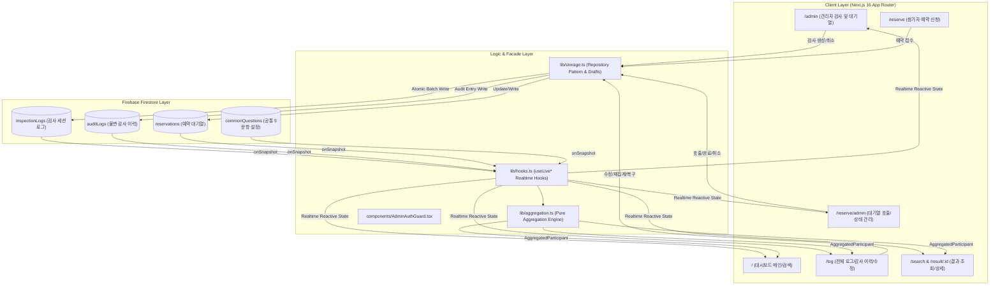
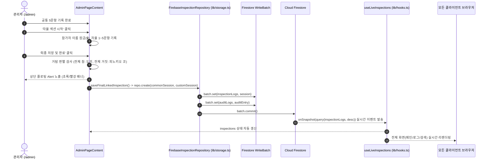
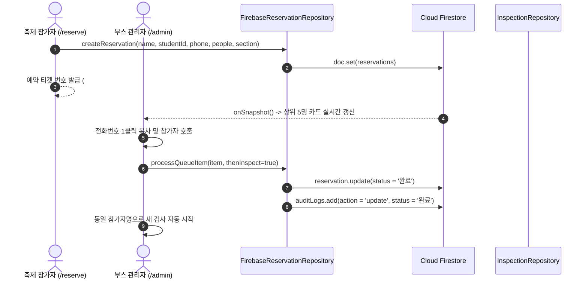
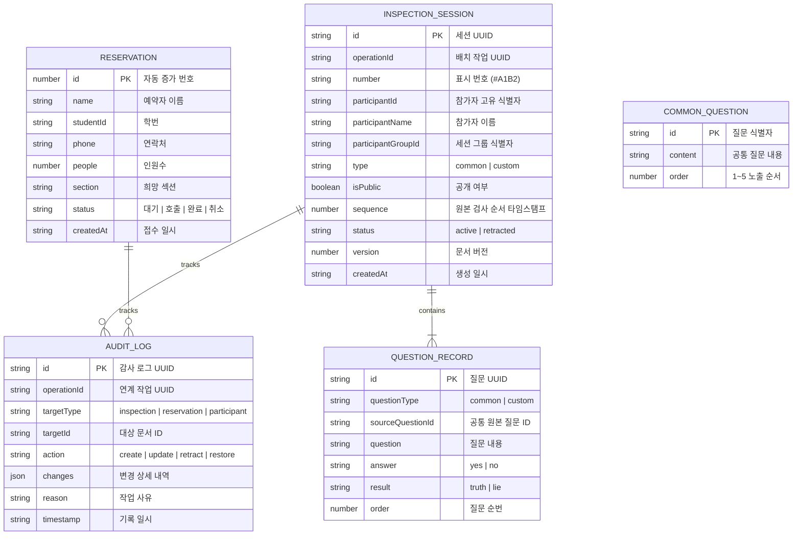
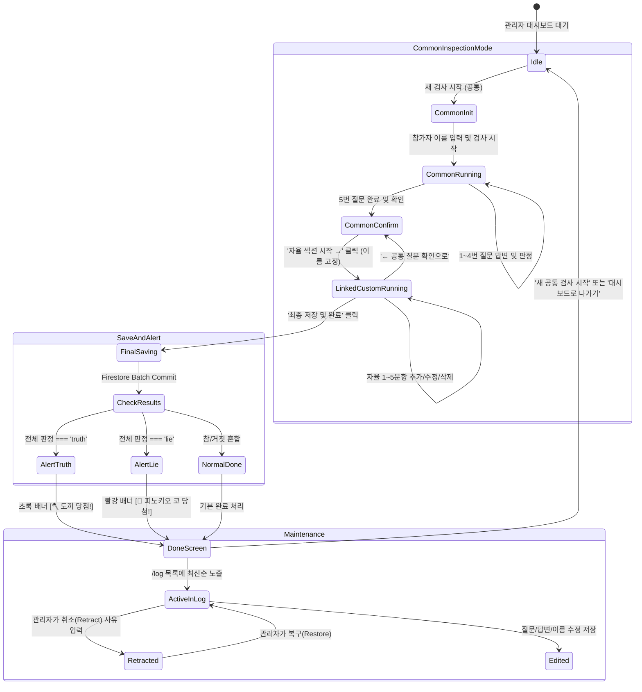

# 시스템 아키텍처 화이트보드 (Architecture Review Whiteboard)

> **프로젝트**: SUNRIN FESTIVAL 2026 — 거짓말탐지기 부스 시스템 (`sunrin-fest-Sneaky`)  
> **핵심 스택**: Next.js 16 (App Router, Turbopack), React 19, TypeScript, Tailwind CSS v4, Firebase Firestore Client SDK  
> **작성 목적**: 시스템 전체 데이터 흐름, 읽기/쓰기 접근 패턴, 상태 동기화 메커니즘, 핵심 코드 경로에 대한 전체 아키텍처 리뷰

---

## 1. 상위 시스템 토폴로지 (High-Level Topology)

Next.js 16 App Router 기반의 완전한 클라이언트 주도(Client-Driven) 실시간 아키텍처입니다. 별도의 백엔드 Node.js/API 서버 없이 브라우저 클라이언트가 Firestore Client SDK 및 반응형 훅(`lib/hooks.ts`)을 통해 실시간 데이터 동기화와 저장소 Facade(`lib/storage.ts`)를 처리합니다.

---

## 2. 핵심 데이터 흐름 (Main Data Flows)

### A. 검사 등록 및 실시간 동기화 흐름 (Inspection Write & Sync Path)
관리자가 공통 5문항 검사 후 연계 개별 자율 질문(최대 5문항)을 등록하고 최종 저장할 때 발생하는 엔드-투-엔드 흐름입니다.

---

### B. 예약 접수 및 대기열 처리 흐름 (Reservation Queue Flow)
참가자가 현장에서 스마트폰으로 예약하고, 관리자가 대시보드에서 순번을 호출/입장 처리하는 흐름입니다.

---

## 3. 세션 집계 엔진 아키텍처 (Pure Aggregation Engine)

동일 참가자가 여러 번 검사를 받았거나, 공통 검사와 자율 검사가 분리 저장된 경우 `lib/aggregation.ts`가 이를 100% 결정론적(Deterministic)으로 통합합니다.

```mermaid
flowchart LR
    subgraph Inputs ["원천 입력 데이터"]
        RawLogs["모든 검사 세션들<br/>(InspectionSession[])"]
        CommonQs["공통 질문 목록<br/>(CommonQuestion[])"]
    end

    subgraph Pipeline ["집계 파이프라인 (aggregateParticipant)"]
        F1["1. 취소 세션 제외<br/>(status !== 'retracted')"]
        F2["2. 참가자 ID/이름 기준 그룹화<br/>(participantId or name_*)"]
        F3["3. 원본 시퀀스/시간순 정렬<br/>(getOriginalLogOrder 오름차순)"]
        F4["4. 공통 질문 최신화<br/>(최신 세션 값으로 덮어쓰고 관리자 순서 정렬)"]
        F5["5. 자율 질문 누적<br/>(시간순으로 모든 질문 순차 누적)"]
        F6["6. 통계 산출<br/>(truthCount, lieCount, truthRate)"]
    end

    subgraph Output ["통합 결과"]
        Agg["AggregatedParticipant<br/>- 최신 참가자 메타데이터<br/>- 통합 정렬된 전체 질문 목록<br/>- 진실/거짓 통계 & 백분율"]
    end

    Inputs --> F1 --> F2 --> F3 --> F4 --> F5 --> F6 --> Output
```

---

## 4. 엔티티 관계도 (Entity-Relationship Model)

---

## 5. 검사 세션 생명주기 및 상태 머신 (Inspection Lifecycle)

---

## 6. 핵심 코드 경로 및 모듈 매핑 (Code Paths & Responsibilities)

| 경로 / 파일 | 레이어 | 주요 역할 및 아키텍처 특성 |
| :--- | :--- | :--- |
| [`lib/storage.ts`](file:///C:/Users/diamo/Deskktoptop/Desktop/School/SHARC/sunrin-fest-Sneaky/lib/storage.ts) | Persistence Facade | **저장소 추상화 계층** - `FirebaseInspectionRepository`: 세션 생성/수정/취소(`retract`)/복구(`restore`) - 모든 쓰기 시 `auditLogs` 불변 감사 로그를 원자적 트랜잭션(`writeBatch`)으로 동시 기록 - 최신순 실시간 구독: `query(collection, orderBy("createdAt", "desc"))` |
| [`lib/aggregation.ts`](file:///C:/Users/diamo/Deskktoptop/Desktop/School/SHARC/sunrin-fest-Sneaky/lib/aggregation.ts) | Business Domain | **순수 함수 기반 데이터 집계 엔진** - 취소 로그(`retracted`) 필터링 배제 - 시간순 공통 질문 최신화 및 순서 보정 - 자율 질문 시간순 누적 및 진실률 통계 산출 |
| [`lib/hooks.ts`](file:///C:/Users/diamo/Deskktoptop/Desktop/School/SHARC/sunrin-fest-Sneaky/lib/hooks.ts) | Reactive State | **실시간 리액티브 훅 계층** - `useLiveInspections`, `useLiveReservations`, `useLiveAuditLogs` - 컴포넌트 마운트 시 Firestore `onSnapshot` 구독, 언마운트 시 자동 해제 |
| [`app/admin/page.tsx`](file:///C:/Users/diamo/Deskktoptop/Desktop/School/SHARC/sunrin-fest-Sneaky/app/admin/page.tsx) | UI Presentation | **관리자 메인 대시보드** - 상위 5팀 대기열 관리, 원클릭 전화번호 복사 및 입장 처리 - 새 검사 등록: 공통 5문항 ➔ 연계 자율 문항(최대 5문항, 이름 고정) - 헤더 행 동일 Y축에 일자형 최근 검사 요약 박스 배치 - 전체 참/거짓 달성 시 상단 플로팅 Alert 배너(도끼/피노키오 코) 노출 |
| [`app/log/page.tsx`](file:///C:/Users/diamo/Deskktoptop/Desktop/School/SHARC/sunrin-fest-Sneaky/app/log/page.tsx) | Admin Audit | **전체 기록 및 감사 로그 관리** - 최신 작성일시 기준 내림차순 정렬 (`b.createdAt - a.createdAt`) - 로그 공개/비공개 토글, 수정, 취소(사유 필수 입력), 복구 - 주요 상태 변경 작업 후 `window.location.reload()` 자동 새로고침 보장 |
| [`app/reserve/page.tsx`](file:///C:/Users/diamo/Deskktoptop/Desktop/School/SHARC/sunrin-fest-Sneaky/app/reserve/page.tsx) | Public Flow | **참가자 현장 예약 접수** - 이름/학번/연락처/인원/섹션 입력 후 즉시 순번표 발급 |
| [`app/search/page.tsx`](file:///C:/Users/diamo/Deskktoptop/Desktop/School/SHARC/sunrin-fest-Sneaky/app/search/page.tsx) | Public Query | **참가자 검사 결과 검색** - 참가자 이름 검색 시 집계 엔진(`aggregateParticipants`)을 거쳐 공통/자율 통합 결과 제공 |

---

## 7. 복원력 및 보안 설계 (Resiliency & Security)

1. **감사 추적성 (Full Audit Trail)**:
   - 검사 세션 및 예약 변경 시 `auditLogs` 컬렉션에 `beforeVersion`, `afterVersion`, `changes`, `reason`을 포함한 불변 감사 기록이 함께 커밋됩니다.
2. **소프트 삭제 (Soft Delete via Retract)**:
   - 관리자가 기록을 삭제할 때 실제로 DB 문서를 삭제하지 않고 `status: "retracted"`와 취소 사유를 저장하여 언제든지 안전하게 복구할 수 있습니다.
3. **클라이언트 사이드 하이드레이션 안전성**:
   - `typeof window === "undefined"` 가드와 `useEffect` 기반 훅을 통해 SSR/SSG 환경과의 충돌 없이 브라우저에서 안전하게 실행됩니다.
4. **빌드 무결성**:
   - Turbopack 및 엄격한 TypeScript 컴파일 체크를 통해 8개 정적/동적 라우트의 무결성이 보장됩니다.
